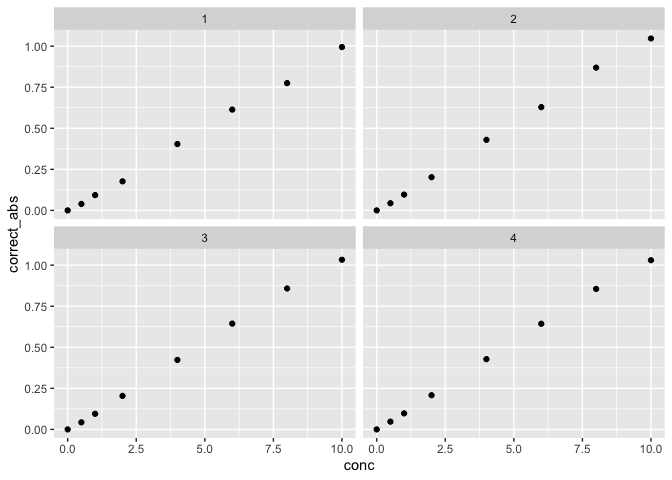
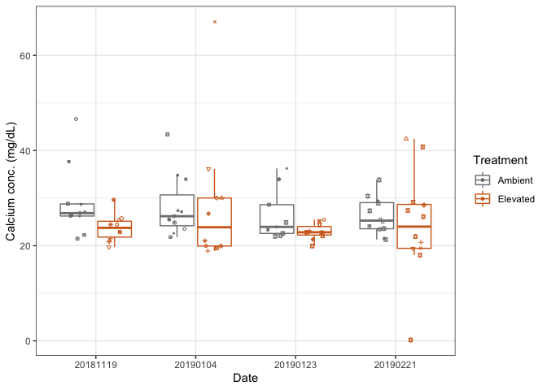
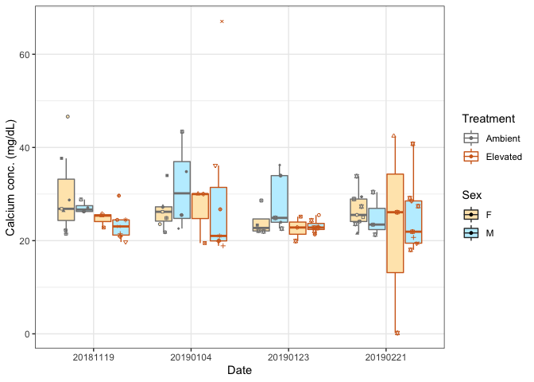
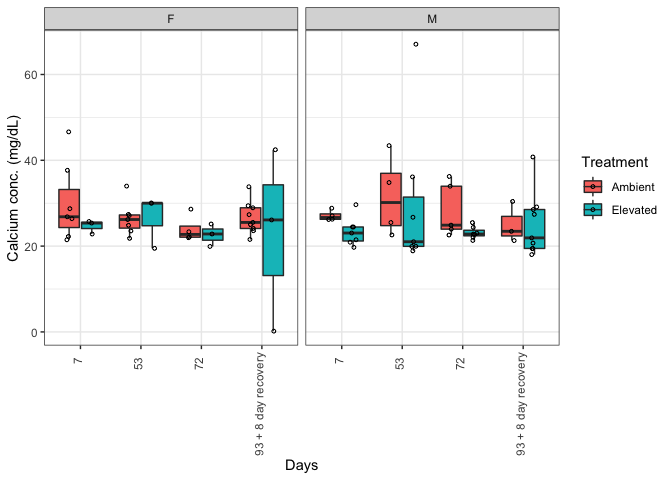

Ca Assay Analysis
================
Shelly Trigg
12/7/2020

load libraries

``` r
library(readxl)
library(dplyr)
```

    ## 
    ## Attaching package: 'dplyr'

    ## The following objects are masked from 'package:stats':
    ## 
    ##     filter, lag

    ## The following objects are masked from 'package:base':
    ## 
    ##     intersect, setdiff, setequal, union

``` r
library(tidyr)
library(ggplot2)
```

load data

``` r
ca_data <- read_xlsx("../data/20201125/CompiledData.xlsx")

sample_info <- read_xlsx("../data/20201125/CompiledData.xlsx", sheet = 'SampleInfo' )
```

calculate the avg abs for each standard

``` r
ca_data_sum <- ca_data %>% group_by(Plate, ID) %>% summarise(mean_abs = mean(`Absorbance @ 570 (1.0s) (A)`))
```

    ## `summarise()` regrouping output by 'Plate' (override with `.groups` argument)

calculate the corrected absorbance by subtracting STD\_A from all
measurements

``` r
ca_data_sum_corrected <- ca_data_sum %>% group_by(Plate) %>% mutate(correct_abs = mean_abs - mean_abs[which(ID == "STD_A")])
```

add column with std concentrations

``` r
ca_data_sum_corrected$conc <- NA

for (i in 1:nrow(ca_data_sum_corrected)){
  if(ca_data_sum_corrected$ID[i]=="STD_A"){
    ca_data_sum_corrected$conc[i] <- 0
  }
  if(ca_data_sum_corrected$ID[i]=="STD_B"){
    ca_data_sum_corrected$conc[i] <- 0.5
  }
  if(ca_data_sum_corrected$ID[i]=="STD_C"){
    ca_data_sum_corrected$conc[i] <- 1
  }
  if(ca_data_sum_corrected$ID[i]=="STD_D"){
    ca_data_sum_corrected$conc[i] <- 2
  }
  if(ca_data_sum_corrected$ID[i]=="STD_E"){
    ca_data_sum_corrected$conc[i] <- 4
  }
  if(ca_data_sum_corrected$ID[i]=="STD_F"){
    ca_data_sum_corrected$conc[i] <- 6
  }
  if(ca_data_sum_corrected$ID[i]=="STD_G"){
    ca_data_sum_corrected$conc[i] <- 8
  }
  if(ca_data_sum_corrected$ID[i]=="STD_H"){
    ca_data_sum_corrected$conc[i] <- 10
  }
}
```

plot corrected STD abs

``` r
ggplot(ca_data_sum_corrected[grep("STD",ca_data_sum_corrected$ID),], aes(conc,correct_abs)) + geom_point() + facet_wrap(~Plate)
```

<!-- -->

run linear models to calculate the slope and intercept

``` r
#plate 1
summary(lm(conc ~ correct_abs, data = ca_data_sum_corrected[which(ca_data_sum_corrected$Plate ==1 & substr(ca_data_sum_corrected$ID,1,3) == "STD"),]))
```

    ## 
    ## Call:
    ## lm(formula = conc ~ correct_abs, data = ca_data_sum_corrected[which(ca_data_sum_corrected$Plate == 
    ##     1 & substr(ca_data_sum_corrected$ID, 1, 3) == "STD"), ])
    ## 
    ## Residuals:
    ##       Min        1Q    Median        3Q       Max 
    ## -0.202798 -0.078272 -0.004107  0.068582  0.186255 
    ## 
    ## Coefficients:
    ##             Estimate Std. Error t value Pr(>|t|)    
    ## (Intercept)  0.06887    0.07468   0.922    0.392    
    ## correct_abs  9.99316    0.14335  69.710 5.86e-10 ***
    ## ---
    ## Signif. codes:  0 '***' 0.001 '**' 0.01 '*' 0.05 '.' 0.1 ' ' 1
    ## 
    ## Residual standard error: 0.1414 on 6 degrees of freedom
    ## Multiple R-squared:  0.9988, Adjusted R-squared:  0.9986 
    ## F-statistic:  4859 on 1 and 6 DF,  p-value: 5.863e-10

``` r
#plate 2
summary(lm(conc ~ correct_abs, data = ca_data_sum_corrected[which(ca_data_sum_corrected$Plate ==2 & substr(ca_data_sum_corrected$ID,1,3) == "STD"),]))
```

    ## 
    ## Call:
    ## lm(formula = conc ~ correct_abs, data = ca_data_sum_corrected[which(ca_data_sum_corrected$Plate == 
    ##     2 & substr(ca_data_sum_corrected$ID, 1, 3) == "STD"), ])
    ## 
    ## Residuals:
    ##      Min       1Q   Median       3Q      Max 
    ## -0.19308 -0.06200  0.03834  0.05283  0.14293 
    ## 
    ## Coefficients:
    ##             Estimate Std. Error t value Pr(>|t|)    
    ## (Intercept)  0.05635    0.05957   0.946    0.381    
    ## correct_abs  9.36225    0.10693  87.556  1.5e-10 ***
    ## ---
    ## Signif. codes:  0 '***' 0.001 '**' 0.01 '*' 0.05 '.' 0.1 ' ' 1
    ## 
    ## Residual standard error: 0.1126 on 6 degrees of freedom
    ## Multiple R-squared:  0.9992, Adjusted R-squared:  0.9991 
    ## F-statistic:  7666 on 1 and 6 DF,  p-value: 1.495e-10

``` r
#plate 3
summary(lm(conc ~ correct_abs, data = ca_data_sum_corrected[which(ca_data_sum_corrected$Plate ==3 & substr(ca_data_sum_corrected$ID,1,3) == "STD"),]))
```

    ## 
    ## Call:
    ## lm(formula = conc ~ correct_abs, data = ca_data_sum_corrected[which(ca_data_sum_corrected$Plate == 
    ##     3 & substr(ca_data_sum_corrected$ID, 1, 3) == "STD"), ])
    ## 
    ## Residuals:
    ##       Min        1Q    Median        3Q       Max 
    ## -0.146744 -0.060882 -0.003321  0.055920  0.200634 
    ## 
    ## Coefficients:
    ##             Estimate Std. Error t value Pr(>|t|)    
    ## (Intercept)  0.03971    0.06427   0.618    0.559    
    ## correct_abs  9.44792    0.11614  81.350 2.32e-10 ***
    ## ---
    ## Signif. codes:  0 '***' 0.001 '**' 0.01 '*' 0.05 '.' 0.1 ' ' 1
    ## 
    ## Residual standard error: 0.1211 on 6 degrees of freedom
    ## Multiple R-squared:  0.9991, Adjusted R-squared:  0.9989 
    ## F-statistic:  6618 on 1 and 6 DF,  p-value: 2.323e-10

``` r
#plate 4
summary(lm(conc ~ correct_abs, data = ca_data_sum_corrected[which(ca_data_sum_corrected$Plate ==4 & substr(ca_data_sum_corrected$ID,1,3) == "STD"),]))
```

    ## 
    ## Call:
    ## lm(formula = conc ~ correct_abs, data = ca_data_sum_corrected[which(ca_data_sum_corrected$Plate == 
    ##     4 & substr(ca_data_sum_corrected$ID, 1, 3) == "STD"), ])
    ## 
    ## Residuals:
    ##      Min       1Q   Median       3Q      Max 
    ## -0.13371 -0.08293  0.00496  0.04981  0.20371 
    ## 
    ## Coefficients:
    ##             Estimate Std. Error t value Pr(>|t|)    
    ## (Intercept) 0.005814   0.063588   0.091     0.93    
    ## correct_abs 9.504359   0.115038  82.619 2.12e-10 ***
    ## ---
    ## Signif. codes:  0 '***' 0.001 '**' 0.01 '*' 0.05 '.' 0.1 ' ' 1
    ## 
    ## Residual standard error: 0.1193 on 6 degrees of freedom
    ## Multiple R-squared:  0.9991, Adjusted R-squared:  0.999 
    ## F-statistic:  6826 on 1 and 6 DF,  p-value: 2.118e-10

``` r
# I also did this in excel and I get different values (see below); since I trust excel more than this lm, I'm going with the excel values

#excel slope and intercept values
# plate 1:
  # slope: 0.0999
  # intercept: -0.0064

#plate 2: 
  # slope: 0.1067
  # intercept: -0.0057

#plate 3: 
  # slope: 0.1057
  # intercept: -0.0038

#plate 4:
  # slope: 0.1051
  # intercept: -0.0002
```

calculate calcium concentration from slope

``` r
# conc. = (corrected sample abs - y intercept / slope) * sample dilution
for (i in 1:nrow(ca_data_sum_corrected)){
  if(substr(ca_data_sum_corrected$ID[i],1,3)!="STD" & ca_data_sum_corrected$Plate[i] == 1){
    ca_data_sum_corrected$conc[i] <- (ca_data_sum_corrected$correct_abs[i] + 0.0064 / 0.0999) * 4
  }
  if(substr(ca_data_sum_corrected$ID[i],1,3)!="STD" & ca_data_sum_corrected$Plate[i] == 2){
    ca_data_sum_corrected$conc[i] <- (ca_data_sum_corrected$correct_abs[i] + 0.0057 / 0.1067) * 4
  }
  if(substr(ca_data_sum_corrected$ID[i],1,3)!="STD" & ca_data_sum_corrected$Plate[i] == 3){
    ca_data_sum_corrected$conc[i] <- (ca_data_sum_corrected$correct_abs[i] + 0.0038 / 0.1057) * 4
  }
  if(substr(ca_data_sum_corrected$ID[i],1,3)!="STD" & ca_data_sum_corrected$Plate[i] == 4){
    ca_data_sum_corrected$conc[i] <- (ca_data_sum_corrected$correct_abs[i] + 0.0002 / 0.1051) * 4
  }
}

#correct conc for ID 01/23-037L which was a 1:7 dilution (5uL in 35uL total)
ca_data_sum_corrected[which(ca_data_sum_corrected$ID == "01/23-037L"),"conc"] <- (data.frame(ca_data_sum_corrected[which(ca_data_sum_corrected$ID == "01/23-037L"),"correct_abs"]) + 0.0064 / 0.0999) * 7
```

match up with treatment and time info

``` r
#first check ID is the exact same as the label
head(sample_info[which(sample_info$ID!= sample_info$Label),])
```

    ## # A tibble: 0 x 6
    ## # … with 6 variables: Date <dbl>, ID <chr>, Tank <chr>, Treatment <chr>,
    ## #   Label <chr>, Sex <chr>

``` r
#now create ID column to match with plate reader data
sample_info$ID <- paste0(substr(sample_info$Date,5,6),"/",substr(sample_info$Date,7,8),"-",sample_info$Label)


#merge sample info with plate reader data
ca_data_sum_corrected_info <- merge(ca_data_sum_corrected, sample_info, by = "ID")


#create a column with the number of sampling points called "freq"
ca_data_sum_corrected_info <- merge(ca_data_sum_corrected_info,table(Label = ca_data_sum_corrected_info$Label), by =  "Label")

#create a column with factors to use for labeling individuals with multiple sampling points

ca_data_sum_corrected_info$name <- factor(ifelse(ca_data_sum_corrected_info$Freq !=1,paste0(ca_data_sum_corrected_info$Label,"_",ca_data_sum_corrected_info$Freq),1))
```

plot

``` r
ggplot(ca_data_sum_corrected_info, aes(x = factor(Date), y = conc, group = interaction(Treatment,factor(Date)),color = Treatment)) + geom_boxplot(outlier.shape = NA) + geom_point(shape = ca_data_sum_corrected_info$name,size=1,position = position_jitterdodge(jitter.width = 0.2)) + theme_bw() + labs(x = "Date", y = "Calcium conc. (mg/dL)") + scale_shape_manual(values=1:nlevels(ca_data_sum_corrected_info$name))  + scale_color_manual(values = c("gray50", "chocolate"))
```

<!-- -->

run aov

``` r
aov_data <- aov(conc ~ Treatment * Date, data = ca_data_sum_corrected_info)
summary(aov_data)
```

    ##                Df Sum Sq Mean Sq F value Pr(>F)  
    ## Treatment       1   2.09  2.0875   3.227 0.0762 .
    ## Date            1   0.06  0.0646   0.100 0.7528  
    ## Treatment:Date  1   0.60  0.5956   0.921 0.3402  
    ## Residuals      81  52.40  0.6469                 
    ## ---
    ## Signif. codes:  0 '***' 0.001 '**' 0.01 '*' 0.05 '.' 0.1 ' ' 1

Plot data but separate females from males

``` r
ggplot(ca_data_sum_corrected_info, aes(x = factor(Date), y = conc, group = interaction(Sex,Treatment,factor(Date)),color = Treatment, fill = Sex)) + geom_boxplot(outlier.shape = NA) + geom_point(shape = ca_data_sum_corrected_info$name,size=1,position = position_jitterdodge(jitter.width = 0.1)) + theme_bw() + labs(x = "Date", y = "Calcium conc. (mg/dL)") + scale_shape_manual(values=1:nlevels(ca_data_sum_corrected_info$name)) + scale_color_manual(values = c("gray50", "chocolate")) + scale_fill_manual(values = c("wheat1","lightblue1"))
```

<!-- -->

Convert date to days

``` r
#create a column for days to go into 
ca_data_sum_corrected_info$days <- NA


for(i in 1:nrow(ca_data_sum_corrected_info)){
  if(ca_data_sum_corrected_info$Date[i] == "20181119"){
    ca_data_sum_corrected_info$days[i] <- "7"
  }
  if(ca_data_sum_corrected_info$Date[i] == "20190104"){
    ca_data_sum_corrected_info$days[i] <- "53"
  }
  if(ca_data_sum_corrected_info$Date[i] == "20190123"){
    ca_data_sum_corrected_info$days[i] <- "72"
  }
  if(ca_data_sum_corrected_info$Date[i] == "20190221"){
    ca_data_sum_corrected_info$days[i] <- "93 + 8 day recovery"
  }
}

ca_data_sum_corrected_info$days <- factor(ca_data_sum_corrected_info$days, levels = c("7", "53", "72", "93 + 8 day recovery"))

count_summary <- ca_data_sum_corrected_info %>% group_by(Sex,days) %>% count()
```

Separate plots for males and females

``` r
ggplot(ca_data_sum_corrected_info, aes(x = days, y = conc, group = interaction(Sex,Treatment,days),fill = Treatment)) + geom_boxplot(outlier.shape = NA) + geom_point(size=1,shape = 1,position = position_jitterdodge(jitter.width = 0.1)) +  theme_bw() + theme(axis.text.x = element_text(angle=90,hjust=0.95,vjust=0.2))  + labs(x = "Days", y = "Calcium conc. (mg/dL)") + facet_wrap(~Sex)
```

<!-- -->

run aov for female data

``` r
f_aov_data <- aov(conc ~ Treatment * days, data = ca_data_sum_corrected_info[which(ca_data_sum_corrected_info$Sex == "F"),])
summary(f_aov_data)
```

    ##                Df Sum Sq Mean Sq F value Pr(>F)
    ## Treatment       1  1.233  1.2326   2.037  0.163
    ## days            3  1.279  0.4262   0.704  0.557
    ## Treatment:days  3  0.405  0.1350   0.223  0.880
    ## Residuals      31 18.755  0.6050

run aov for male data

``` r
m_aov_data <- aov(conc ~ Treatment * days, data = ca_data_sum_corrected_info[which(ca_data_sum_corrected_info$Sex == "M"),])
summary(m_aov_data)
```

    ##                Df Sum Sq Mean Sq F value Pr(>F)
    ## Treatment       1  1.231  1.2310   1.614  0.212
    ## days            3  2.850  0.9500   1.245  0.307
    ## Treatment:days  3  0.401  0.1338   0.175  0.912
    ## Residuals      38 28.991  0.7629
